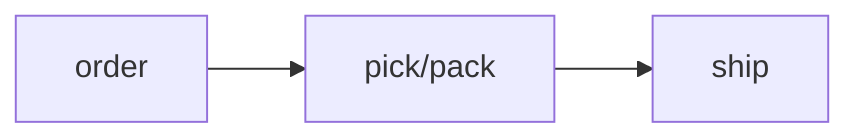

# Order Intake

**Owner role:** → [owner.md](../roles/owner.md)
**Last updated:** 2026-06-10

## Jobs-to-be-done

When a customer places an order, the owner wants to fulfill it same day, so the customer reorders.

## SOP

- [ ] **Receive** — owner uses [shopify](../tools/shopify.md) on order — captures the order
  - Exception: payment declines → retry or call customer
- [ ] **Pick & pack** — owner uses warehouse on order — readies the box
- [ ] **Ship** — owner uses [shopify](../tools/shopify.md) on order — prints label

### Flowchart — ASCII (for humans)

```
[order] -> [pick/pack] -> [ship]
   # the # here must not be read as a heading
```

### Flowchart — Mermaid (for machines)



## Automation / Agent Potential

**Target KOODAR level:** KDA
**Lives in:** Zapier
**Approach:** Use existing integration: Shopify → Slack

Auto-notify fulfillment on new order; human still packs.

**Constraints:**
- Prior attempts / prior approach: none
- Integration walls: none known
